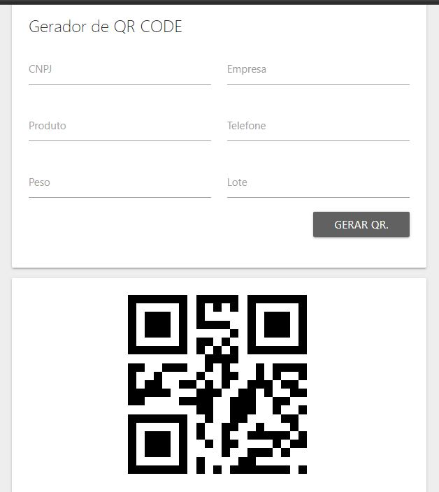

<h1 align="center">QrCode</h1>

## Descrição do projeto
<p align="center">SPA para geração de QrCode, composto pelos valores dos campos de texto da página</p>

<h4 align="center"> 
	:black_square_button::white_square_button: QrCode :white_square_button::black_square_button: Concluído :white_check_mark:
</h4>

## Screen Shot
<p align="center" style="display: flex; align-items: flex-start; justify-content: center;">
  
</p>

## Como executar o projeto

### Pré-requisitos

Antes de começar, você vai precisar ter instalado em sua máquina as seguintes ferramentas:
[Git](https://git-scm.com), [Node.js](https://nodejs.org/en/). 
Além disto é bom ter um editor para trabalhar com o código como [VSCode](https://code.visualstudio.com/)

### Rodando a aplicação

```bash

# Clone este repositório
$ git clone git@github.com:evertonjulian/QrCode.git

# Acesse a pasta do projeto no seu terminal/cmd
$ cd QrCode

# Instale as dependências
$ npm install

# Execute a aplicação
$ npm start

# A aplicação será aberta na porta:3000 - acesse http://localhost:3000

```

## Tecnologias

As seguintes ferramentas foram usadas na construção do projeto:

- [Node.js](https://nodejs.org/en/)
- [React](https://pt-br.reactjs.org/)
- [TypeScript](https://www.typescriptlang.org/)

## Autor

  
 <sub><b>Everton Goulart</b></sub>

[](https://www.linkedin.com/in/everton-julian-silva-goulart/) 
[](mailto:evertonjulian@gmail.com)

## Licença

Este projeto esta sobe a licença [MIT](./LICENSE).
